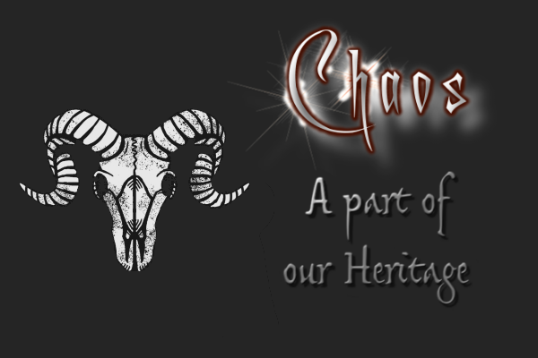

***The Network:***

### - Discord Groups:

---

### - [PlaidArmy.com](https://plaidarmy.com)

 - #Open-Borders: [https://discord.com/invite/swQ8N6C](https://discord.com/invite/swQ8N6C)
 - the Chaos server is community-maintained. Join at your own risk.

---

   

### - Alternative Platforms:

***Element.io (formerly riot.im)***

An [Element.io](https://element.io/) server deployed on [chat.chaos.network](https://matrix.to/#/!OBVoauFGQFEOTJyJdW:chat.chaos.network?via=chat.chaos.network) serves as the backbone to the network. This private chat server is open to the public.

- [Download](https://element.io/get-started) the Element.io client or use the [Browser version](https://element.io/get-started) 
- Switch to a private server:  **chat.chaos.network**
- Create an account
- [Join the chaos](https://matrix.to/#/!OBVoauFGQFEOTJyJdW:chat.chaos.network?via=chat.chaos.network)

---

***Keybase***

[Keybase](https://keybase.io/) is a cryptocurrency-friendly, end-to-end encrypted chat application.

- [https://keybase.io/team/chaos_network](https://keybase.io/team/chaos_network)

---

- [network.chaos@protonmail.com](network.chaos@protonmail.com)

---
